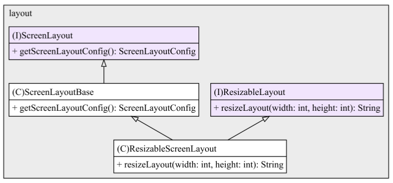

# DesignPatterns
This project is about testing Design Patterns and other important Software Principles in a small mock application. 

### Theme: Homepage Screen Startup
This app simulates a Component of any bigger Application, responsible to set up the Screens (frontend) of webpages. This includes setting up the screen theme, layout, colors, components and User access.

### Usage example
Input:
``` 
//Defining layout and access type of homepage
ScreenLayoutType layoutChosen = ScreenLayoutType.TYPE_A;
HomePageType accessTypeChose = HomePageType.ADMIN_NOT_REQUIRED;
//Creating a Screen with theme DARK (creation is abstracted by the Factory)
ScreenFactory factory = new ScreenFactory();
Screen screen = factory.createScreenDarkTheme(layoutChosen, accessTypeChose);
//Printing results via the PrintService
PrintService printService = new PrintService();
printService.printDetailsOfScreen(screen);
printService.printAnimation(screen);
```
Output
``` 
**************************************************
Details of Screen called:
Theme details with the Style: theme.ScreenThemeDark and settings:
- backgroundColor:Black
- textColor:White
- textFont:Calibri
Layout details with the components: 
- buttons:on
- menu:on
- headline:on
- images:off
- navbar:off
The button for animation was clicked:
 -> An animation with black holes exploding shows up

```

### Designs implemented (so far)
1. [Factory](#factory)
2. [Builder](#builder)
3. [Singleton](#singleton)
4. [Strategy](#strategy)

### SOLID Principles implemented
1. [S - Single Purpose Principle](#single-purpose-principle)
2. [O - Open-closed Principle](#open-closed-principle)
3. [L - Liskov Substitution Principle](#liskov-substitution-principle)
4. [I - Interface Segregation Principle](#interface-segregation-principle)
5. [D - Dependency Inversion Principle](#dependency-inversion-principle)


### Designs Patterns
### Factory


### Builder


### Singleton


### Strategy
Screen Theme Strategy



Access Type Strategy


## SOLID Principles

### Single Purpose Principle
The code has the functionality of printing any Data of the Screen embedded in the components. That was a violation of this principle, so the refactoring migrated the Printing purpose to a special class called PrintService.

Old code violation example:


New class PrintService with this responsibility:


### Open-Closed Principle
..

### Liskov Substitution Principle
A new subclass of ScreenThemeLight with no animation was created. The purpose was to have the same Theme but with no animations.


The issue is that the return statement did not follow the same signature as the superclass. That is a violation of the LSP, leaving possible bad behavior from the parent Class. This was the fix:


### Interface Segregation Principle
Content..

### Dependency Inversion Principle
Content..