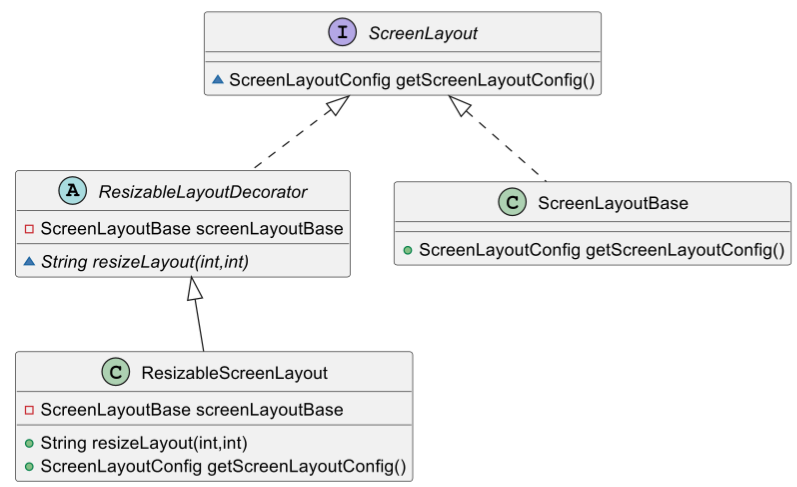

# DesignPatterns
This project is about testing Design Patterns and other important Software Principles in a small mock application. 

### Theme: Homepage screen.Screen Startup
This app simulates a Component of any bigger Application, responsible to set up the Screens (frontend) of webpages. This includes setting up the screen theme, layout, colors, components and User access.

### Usage example
Input:
``` 
//Defining layout and access type of homepage
ScreenLayoutType layoutChosen = ScreenLayoutType.TYPE_A;
HomePageType accessTypeChose = HomePageType.ADMIN_HOME_PAGE;

//Creating a screen.Screen with theme DARK (creation is abstracted by the Factory)
ScreenFactory factory = new ScreenFactory();
Screen screen = factory.createScreenDarkTheme(layoutChosen, accessTypeChose);

//Using the ScreenProxy to run access requirements
SecurityCredentials securityCredentials = new SecurityCredentials("admin","password123");
ScreenProxy screenProxy = new ScreenProxy(screen,securityCredentials);

//Printing results via the PrintService
PrintService printService = new PrintService();
printService.printDetailsOfScreen(screenProxy);
printService.printAnimation(screenProxy);
```
Output
``` 
**************************************************
Details of screen.Screen called:
Theme details with the Style: theme.ScreenThemeDark and settings:
- backgroundColor:Black
- textColor:White
- textFont:Calibri
Layout details with the components: 
- buttons:on
- menu:on
- headline:on
- images:off
- navbar:off
The button for animation was clicked:
 -> An animation with black holes exploding shows up

```

### Designs implemented (so far)
1. [Factory](#factory)
2. [Builder](#builder)
3. [Singleton](#singleton)
4. [Strategy](#strategy)
5. [Proxy](#proxy)
6. [Decorator](#decorator)

### SOLID Principles implemented
1. [S - Single Purpose Principle](#single-purpose-principle)
2. [O - Open-closed Principle](#open-closed-principle)
3. [L - Liskov Substitution Principle](#liskov-substitution-principle)
4. [I - Interface Segregation Principle](#interface-segregation-principle)
5. [D - Dependency Inversion Principle](#dependency-inversion-principle)


### Designs Patterns
### Factory


### Builder


### Singleton


### Strategy
screen.Screen Theme Strategy


Access Type Strategy


### Proxy


### Decorator


## SOLID Principles

### Single Purpose Principle
The code has the functionality of printing any Data of the screen.Screen embedded in the components. That was a violation of this principle, so the refactoring migrated the Printing purpose to a special class called PrintService.

Old code violation example:


New class PrintService with this responsibility:


### Open-Closed Principle
The idea is to create new functionality without changing the original object. With that in mind, the Class ScreenLayout was requested a new feature of resizing the layout in case was necessary.


Instead of changing the ScreenLayout Class, the solution was to create a Decorator structure allowing a new subclass Class. This class is then responsible for adding this new functionality.


### Liskov Substitution Principle
A new subclass of ScreenThemeLight with no animation was created. The purpose was to have the same Theme but with no animations.


The issue is that the return statement did not follow the same signature as the superclass. That is a violation of the LSP, leaving possible bad behavior from the parent Class. This was the fix:


### Interface Segregation Principle
This principle was validated when the Decorator pattern was implemented in ScreenLayout Class, to add new "resizable" functionality. 
It means that ScreenLayoutBase is free of the method resizeLayout() which is not relevant for itself.
This specialized method is only inherited from Interface ResizableLayout, which should only have subclasses that finds this method relevant.


### Dependency Inversion Principle
The Screen Class, considered as a Client Class, had dependency of 3 other concrete Classes:
- ScreenThemeStrategy
- ScreenLayout
- HomePageStrategy

This violates DIP and reflects as a tightly coupled relationship. 
To fix this, all 3 Service Classes were changed to Interfaces, inverting the dependency and decoupling the Classes.

